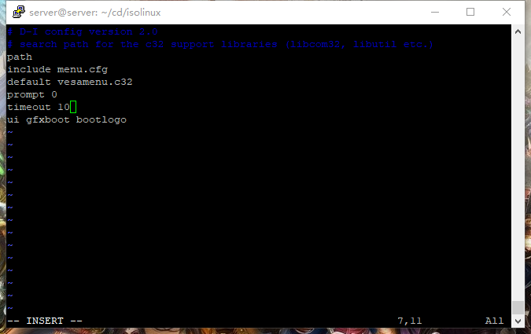

# Linux系统与网络管理

## 1.安装Ubuntu虚拟机并配置两张网卡
- 网卡设置


- 打开虚拟机并安装Ubuntu-server系统

- 安装完成，查看ip发现enp0s8网卡没有打开


查看ip地址为192.168.56.102

- 下载安装ssh服务并检查ssh服务已开启


## 2.使用putty连接虚拟机

- putty


- 连接psftp，利用psftp上传iso文件

    ```
        put ubuntu-16.04.4-server-amd64.iso
    ```


- 在putty输入命令

    ```
    # 在当前用户目录下（/home/cuc）创建一个用于挂载iso镜像文件的目录
    mkdir loopdir

    # 挂载iso镜像文件到该目录
    mount -o loop ubuntu-16.04.1-server-amd64.iso loopdir

    # 创建一个工作目录用于克隆光盘内容
    mkdir cd

    # 同步光盘内容到目标工作目录
    # 一定要注意loopdir后的这个/，cd后面不能有/
    rsync -av loopdir/ cd

    # 卸载iso镜像
    umount loopdir
    ```

    ```
    # 进入目标工作目录
    cd cd/
    # 编辑Ubuntu安装引导界面增加一个新菜单项入口
    vim isolinux/txt.cfg
    添加以下内容到该文件后强制保存退出
    label autoinstall
      menu label ^Auto Install Ubuntu Server
      kernel /install/vmlinuz
      append  file=/cdrom/preseed/ubuntu-server-autoinstall.seed debian-installer/locale=en_US console-setup/layoutcode=us keyboard-configuration/layoutcode=us console-setup/ask_detect=false localechooser/translation/warn-light=true localechooser/translation/warn-severe=true initrd=/install/initrd.gz root=/dev/ram rw quiet
    ```

    执行完成后


- 利用psftp将ubuntu-server-autoinstall.seed文件上传并拷贝到/home/server/cd/preseed/文件夹


- 修改isolinux/isolinux.cfg，更改timeout 0为timeout 10（可选，否则需要手动按下ENTER启动安装界面）


- 重新生成md5sum.txt
    ```
    # 重新生成md5sum.txt
    sudo -s #提升权限
    cd /home/cuc/cd && find . -type f -print0 | xargs -0 md5sum > md5sum.txt
    ```

    ```
    # 封闭改动后的目录到.iso
    IMAGE=custom.iso
    BUILD=/home/cuc/cd/

    mkisofs -r -V "Custom Ubuntu Install CD" \
                -cache-inodes \
                -J -l -b isolinux/isolinux.bin \
                -c isolinux/boot.cat -no-emul-boot \
                -boot-load-size 4 -boot-info-table \
                -o $IMAGE $BUILD
    ```

- 得到custom.iso文件，利用psftp下载到主机

## 3.在vbox安装custom.iso

- 加载custom.iso

- 自动安装


## 4.比较ubuntu-server-autoinstall.seed与官方示例文件

- 使用软件UltraCompare


- 差异

    1.设置地点

    2.设置语言，跳过询问

    3.修改等待时间，关闭网络设置

    4.设置ip，子网掩码，网关，解析服务器

    5.设置主机名，用户名，密码等

    6.设置时区

    7.自动分区，lvm分区设置，选用muiti方式

    8.不使用网络下载镜像，选用server版安装包

    9.预安装openssh-server，不自动升级

    10.自动安全更新 
