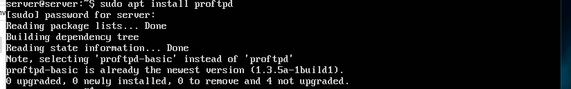
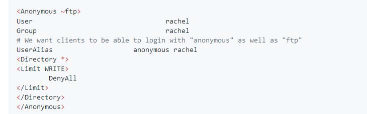
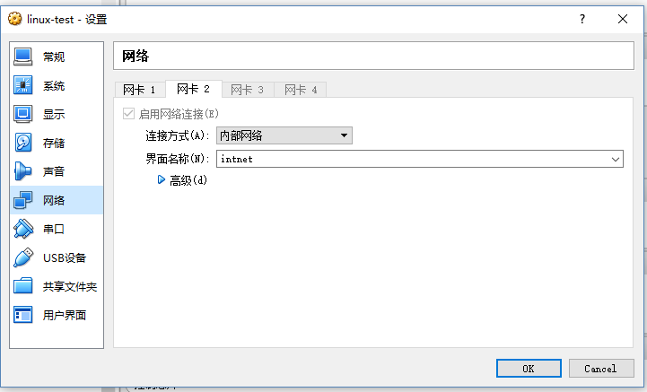
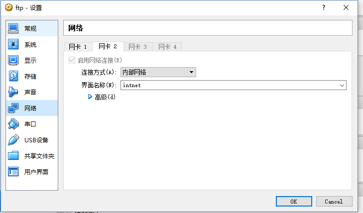

# FTP、NFS、DHCP、DNS、Samba服务器的自动安装与自动配置

## 一、服务器配置

#### 安装proftpd

  

- 修改/etc/proftpd/proftpd.conf

  

  

- 添加ftp虚拟用户

  ```
  # 添加ftp虚拟用户ftp_passwd 使用与rachel相同的uid 目录为/home/ftp
  sudo ftpasswd --passwd --file=/etc/proftpd/ftpd.passwd --name=passwd_test --uid=1000 --home=/home/passwd_test --shell=/sbin/nologin
  # 创建虚拟用户组
  sudo ftpasswd --group --file=/etc/proftpd/ftpd.group --name=passwdtest_group --gid=1000
  # 添加虚拟用户进组
  sudo ftpasswd --group --name=passwdtest_group --gid=99 --member=passwd_test
  ```

- 添加linux同名用户

  ```
  sudo useradd passwd_test
  sudo passwd passwd_test
  ```

- 匿名访问权限仅限白名单IP来源用户访问，禁止白名单IP以外的访问

  anonymous模块中加入
  ```
  <Limit LOGIN ~ftp/*>
  Order allow,deny
  Allow from 192.168.56.101
  Deny from all
  </Limit>
  ```

#### NFS

- 在1台Linux上配置NFS服务，另1台电脑上配置NFS客户端挂载2个权限不同的共享目录，分别对应只读访问和读写访问权限

  server:192.168.137.207

  client:192.168.137.132

  server端安装 ：```apt install nfs-kernel-server```

  client端安装：```apt install nfs-common```

  修改server端的文件```/etc/exports```

  client挂载server端的目录

#### DHCP

- 2台虚拟机使用Internal网络模式连接，其中一台虚拟机上配置DHCP服务，另一台服务器作为DHCP客户端，从该DHCP服务器获取网络地址配置

- client端配置

  

- server端配置

  

- 安装```apt-get install isc-dhcp-server```

- 修改 /etc/network/interfaces

   ```
   auto enp0s8
   iface enp0s8 inet static
   address 10.5.5.2
   netmask 255.255.255.0
   gateway 10.0.5.2
   ```

- 修改/etc/default/isc-dhcp-server

  ```INTERFACES="enp0s8"```
- 修改/etc/dhcp/dhcpd.conf

  ```
  subnet 10.5.5.0 netmask 255.255.255.224 {
     range 10.5.5.26 10.5.5.30;
     option domain-name-servers ns1.internal.example.org;
     option domain-name "internal.example.org";
     option subnet-mask 255.255.255.224;
     option routers 10.5.5.1;
     option broadcast-address 10.5.5.31;
     default-lease-time 600;
     max-lease-time 7200;
    }
    ```

- 开启isc-dhcp-server服务

  ```sudo /etc/init.d/isc-dhcp-server start```

- client

  ```sudo dhclient enp0s8```

#### DNS

- server

  ```sudo apt install bind9```

  ```sudo apt install dnsutils```

- 配置/etc/bind/named.conf.local

```
  zone "cuc.edu.cn"{
  type master;
  file "/etc/bind/db.cuc.edu.cn";
  }
  ```

- 配置/etc/bind/db.cuc.edu.cn

- client

  ```dig wp.sec.cuc.edu.cn```
